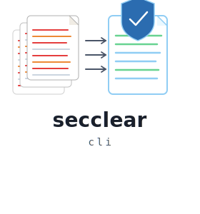
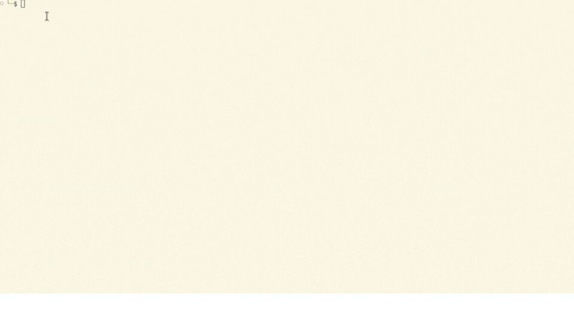
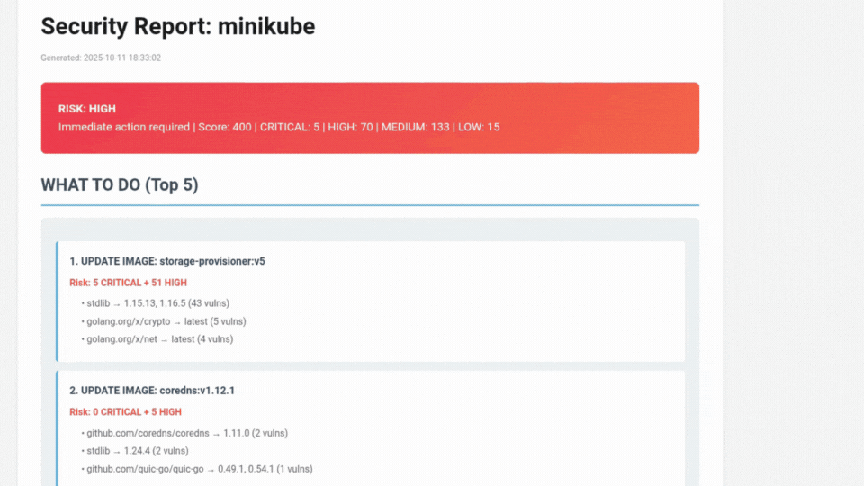

<p align="center">
  
</p>

# secclear

Stop parsing JSONs. Get one clean security report from multiple Kubernetes scanners.



## The Problem

You run Trivy and Grype on your cluster. You get 10,000 lines of JSON. The same CVE shows up 3 times. You spend 2-3 hours parsing it manually. Your boss wants a PowerPoint.

## The Solution

One command. 30 seconds. Clean report.

```bash
secclear scan minikube
```



What you get: Executive summary with top 5 issues. Auto-deduplication shows each CVE once. Scanner comparison tells you which tool found what. High-confidence findings from multiple scanners.

## Supported Scanners

**Image Scanners** (CVE detection):
- [Trivy](https://github.com/aquasecurity/trivy) - Aqua Security
- [Grype](https://github.com/anchore/grype) - Anchore

**Cluster Scanners** (configuration checks):
- [Kubescape](https://github.com/kubescape/kubescape) - ARMO
- [kube-bench](https://github.com/aquasecurity/kube-bench) - Aqua Security
- [Popeye](https://github.com/derailed/popeye) - Derailed

Install at least 2 image scanners. Cluster scanners are optional.

## Install

Quick install:
```bash
curl -sSL https://raw.githubusercontent.com/topcug/secclear-cli/main/install.sh | bash
```

Manual install from [releases](https://github.com/topcug/secclear-cli/releases/latest):
```bash
# Linux
curl -sSL https://github.com/topcug/secclear-cli/releases/latest/download/secclear-linux-amd64 -o secclear
chmod +x secclear
sudo mv secclear /usr/local/bin/

# macOS Intel
curl -sSL https://github.com/topcug/secclear-cli/releases/latest/download/secclear-darwin-amd64 -o secclear
chmod +x secclear
sudo mv secclear /usr/local/bin/

# macOS Apple Silicon
curl -sSL https://github.com/topcug/secclear-cli/releases/latest/download/secclear-darwin-arm64 -o secclear
chmod +x secclear
sudo mv secclear /usr/local/bin/
```

## Usage

```bash
# Scan your cluster
secclear scan minikube

# HTML report
secclear scan minikube --format html

# Specific namespace
secclear scan minikube -n production
```

## Output

Terminal shows risk level, overlap metrics, and high-confidence findings. Reports include top 5 action items, all CRITICAL/HIGH CVEs with fixes, and scanner comparison. See [examples/](examples/) for sample outputs.

## How It Works

Discovers images in your cluster. Runs Trivy and Grype in parallel. Deduplicates CVEs. Runs cluster scanners. Generates reports with scanner attribution.

**Scanner agreement = high confidence.** CVE found by 2+ scanners means definitely fix. CVE found by 1 scanner means review for false positive.

## License

MIT
